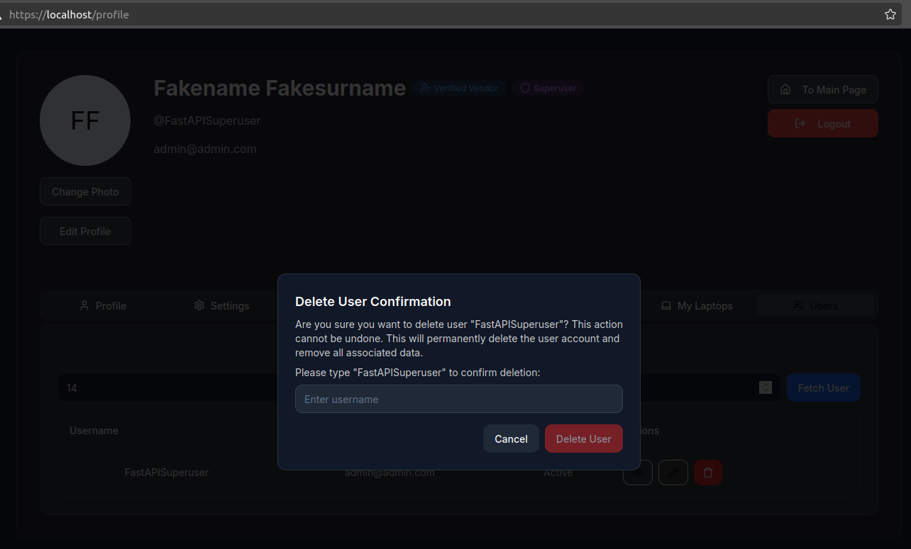
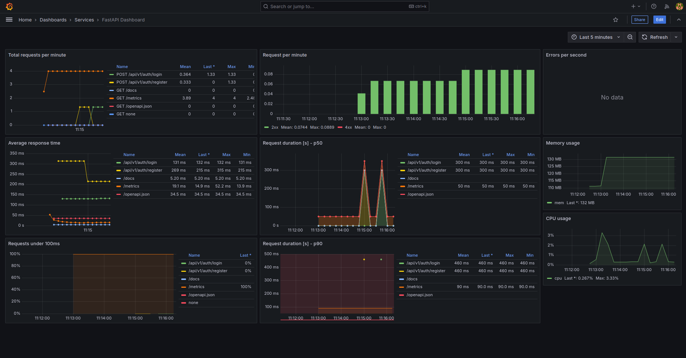
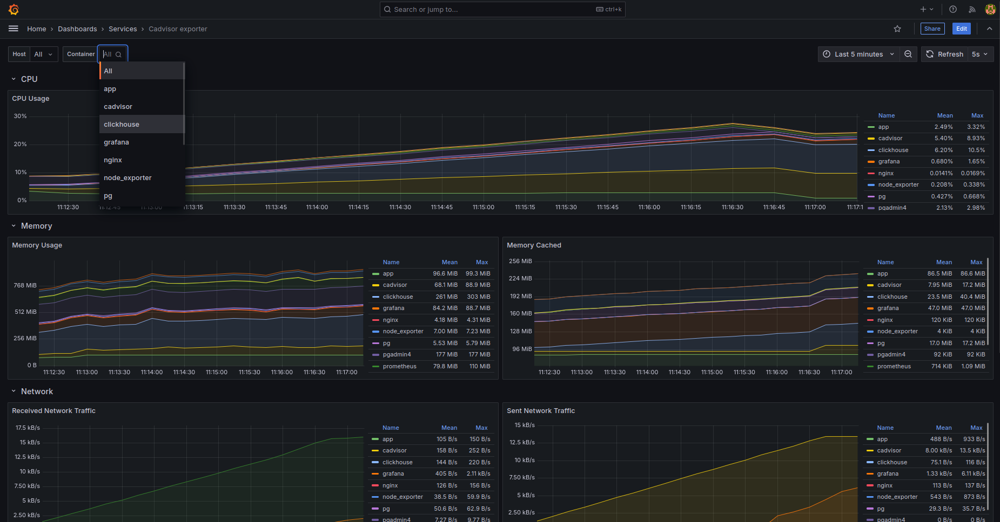

# Base-app FastAPI Application

## This project represents a store for selling laptops(for now) using [FastAPI](https://fastapi.tiangolo.com/), a modern, high-performance web framework for building APIs with Python.

## Technologies used:
* Backend Framework: Utilizes [FastAPI](https://fastapi.tiangolo.com/) for building robust APIs with automatic interactive documentation.
* Frontend Integration: Includes a frontend application built with modern JavaScript frameworks, facilitating seamless integration with the FastAPI backend.
* Database Management: Employs [PostgreSQL](https://www.postgresql.org/) as the primary database for reliable data storage.
* Authentication System: Implements user authentication and authorization mechanisms, ensuring secure access to application resources using [FastAPI-Users](https://fastapi-users.github.io/fastapi-users/latest/).
* Token Storage: Integrates [Redis](https://redis.io/) for efficient and fast token handling, improving data retrieval times and reducing database load.
* Containerization: Provides [Docker](https://www.docker.com/) configurations for consistent development and deployment environments.
* Reverse Proxy: Utilizes [Nginx](https://nginx.org/) as a reverse proxy server to manage client requests and improve security.
* Real-time Monitoring: Includes [Prometheus](https://prometheus.io/), [CAdvisor](https://github.com/google/cadvisor) and [Grafana](https://grafana.com/) for monitoring application performance and health metrics.
* Application Log Storage: Uses [Clickhouse](https://clickhouse.com/) database for local log's storage and [BetterStack](https://betterstack.com/community/guides/logging/docker-logs/) for remote backup utilizing [Vector](https://vector.dev/) as the log's collector.


### Main Page (Frontend)

### User's Profile (Frontend)

### User Management Panel

### Laptops Page (Frontend)

### Interactive API Documentation

### Access Token Response

### FastAPI Endpoints Metrics

### Prometheus Host Metrics

### CAdvisor Containers Metrics

### Containers logs from Clickhouse in Grafana

### Containers logs in [BetterStack](https://betterstack.com/community/guides/logging/docker-logs/) Telemetry


## Getting Started:

#### Clone the Repository:

```shell
git clone https://github.com/Oleksii-Op/FastAPI-Base-App.git
```

> [!NOTE]
> Note that SMTP Google credentials are not required.
> All the passwords and keys are fake and were made with a script.
```shell
python3 -c 'import secrets; print(secrets.token_hex())'
```
#### 1. Run `init_project.sh` script to set up some credentials before start up

#### 2. Once Postgres password and SMTP Server credentials have been set - execute
```shell
docker compose up -d --build
```
#### Docker compose file uses some delay to start Clickhouse FIRST

#### Use command below to verify that all services are running and healthy.
```bash
docker compose ps
```
#### 4. Access the Application:

* Main Page: https://localhost/ in your web browser (Your browser will complain about self-signed certificate, but it's okay.)
* Backend API: http://localhost:8000/docs (Check that ports are opened in docker-compose.yml file)
* Metrics/Logs/Monitoring: https://localhost:3000/ to access Grafana (username: admin , password: pass@123)
* PostgreSQL Data: http://localhost:8020/ to access PGAdmin4 (email: admin@example.com , password: test_admin)

#### You may use `index_page_loader.sh` to simulate some requests to https://localhost/index
#### Metrics in Grafafa FastAPI Dashboard will grow


## Docker networks topology (Deprecated)

